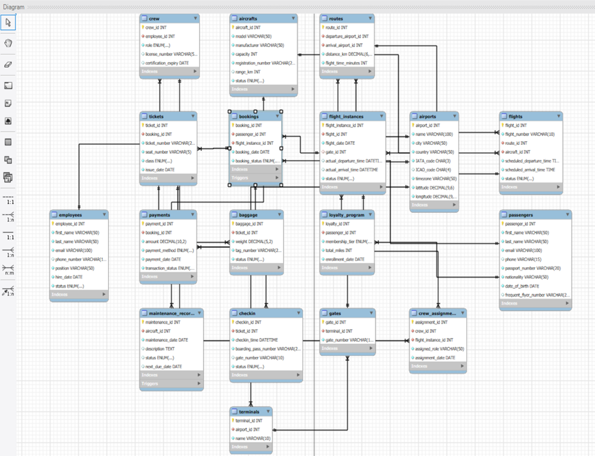

# Airline-Management-System
A comprehensive SQL database for airline operations. Features 18 normalized tables, stored procedures, triggers, and complex analytical queries for flight scheduling, crew management, and ticketing.

---

## 📖 Project Overview

**Course:** BUAN 6320.001 - Database Foundations for Business Analytics  
**Group:** 7  

In the rapidly evolving aviation industry, efficient data management is critical. This project implements a robust **Relational Database Management System (RDBMS)** tailored for airline operations. It addresses the complex data needs of commercial carriers, logistics companies, and charter services.

The system is designed to handle:
* **Core Operations:** Flight scheduling, route management, and aircraft maintenance.
* **Passenger Services:** Booking, ticketing, check-in, and baggage handling.
* **Workforce Management:** Crew scheduling, certification tracking, and duty compliance.
* **Analytics:** Revenue analysis, route popularity, and operational delays.

## 🗂️ Database Architecture

The database consists of **18 normalized tables** designed to ensure data integrity and reduce redundancy.

### Key Modules
1.  **Infrastructure:** `Airports`, `Terminals`, `Gates`
2.  **Fleet:** `Aircrafts`, `Maintenance_Records`
3.  **Staffing:** `Employees`, `Crew`, `Crew_Assignments`
4.  **Operations:** `Routes`, `Flights`, `Flight_Instances`
5.  **Commercial:** `Passengers`, `Bookings`, `Tickets`, `Loyalty_Program`, `Payments`
6.  **Logistics:** `CheckIn`, `Baggage`

### Entity Relationship Diagram (ERD)

*(Note: Please refer to the `ER-diagram/` folder for the high-resolution ER diagram.)*

---

## 🛠️ Technical Implementation

This project utilizes advanced SQL features to enforce business logic and automate workflows. Some key features have been described below:

### 1. Stored Procedures
We implemented transactional procedures to handle complex business actions securely:
* `book_ticket`: Handles seat availability checks and booking insertion atomically to prevent overbooking.
* `cancel_booking`: Automates the cancellation process, updating flight status and triggering refunds.
* `assign_pilot_to_flight`: Enforces role-based assignment (ensuring only Pilots are assigned to pilot roles).
* `calculate_flight_revenue`: Aggregates total revenue per flight instance.

### 2. Functions
Custom functions were created for analytical calculations:
* `GetFlightRevenueBreakdown`: Returns a string summary of revenue by class (Economy, Business, First).
* `GetCrewDutyCompliance`: Checks if a crew member has exceeded the 100-hour duty limit in the last 30 days.
* `GetPassengerLoyaltyRecommendations`: Analyzes flight history to suggest tier upgrades (Silver → Gold).

### 3. Triggers
Triggers ensure real-time data consistency:
* **Maintenance Updates:** Automatically sets aircraft status to 'Active' when maintenance is marked 'Completed'.
* **Refund Automation:** Automatically updates payment status to 'Refunded' when a booking is cancelled.
* **Booking Protection:** Prevents insertion of bookings into flights marked as 'Cancelled'.

### 4. Complex Analytics (Queries)
The system supports high-level decision-making through complex JOINs and aggregations:
* **Route Popularity:** Identifies high-demand routes to optimize fleet allocation (e.g., assigning Airbus A380s to busy routes).
* **Delayed Flight Crew Coordination:** Instantly retrieves crew details for delayed flights to manage duty-time violations.
* **Aircraft Utilization:** Calculates usage rates to assist finance teams in lease management.

---

## 🔮 AI Integration Roadmap

While the current system is a solid database foundation, we have designed it to support future **AI Agent integrations**:
1.  **Predictive Maintenance:** Using `Maintenance_Records` to train ML models to predict failures.
2.  **Dynamic Pricing:** Using `Bookings` demand data to adjust ticket prices in real-time.
3.  **Crew Scheduling Bot:** An AI agent utilizing `GetCrewDutyCompliance` to auto-assign crew based on legal limits and availability.

---

---
